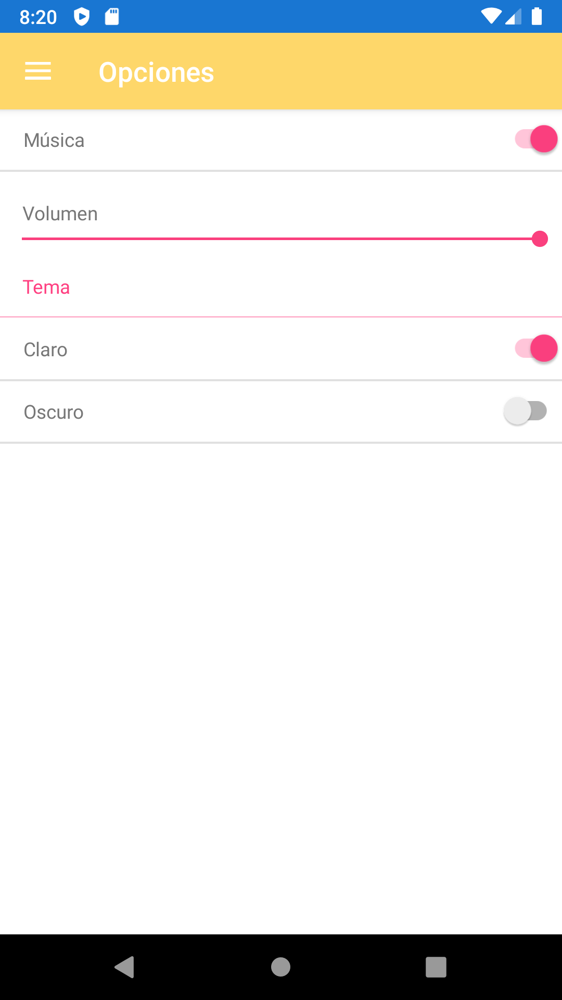
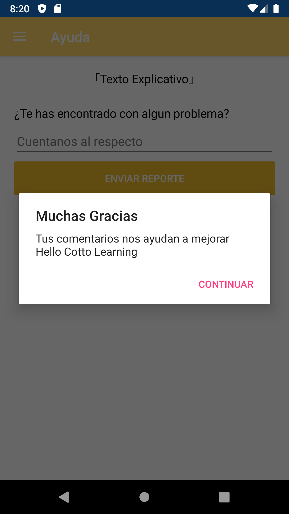

# Hello Cotto Learning

Hello Cotto Learning es una aplicación codificada en C#, utilizando el framework Xamarin, para el aprendizaje del inglés, destinada para un público joven, y en términos generales novato en cuanto a conocimiento del inglés se refiere.

## Screenshots

#### Introducción y Menú Principal
<kbd></kbd>
<kbd></kbd>

#### Menú Lateral y Diferentes modulos
<kbd></kbd>
<kbd></kbd>
<kbd></kbd>
<kbd></kbd>
<kbd></kbd>
<kbd></kbd>
<kbd></kbd>
<kbd></kbd>
